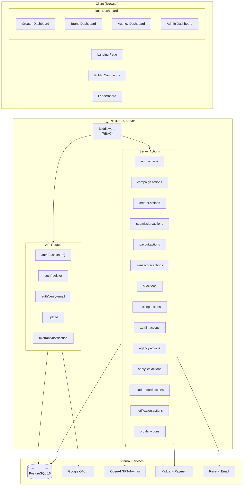
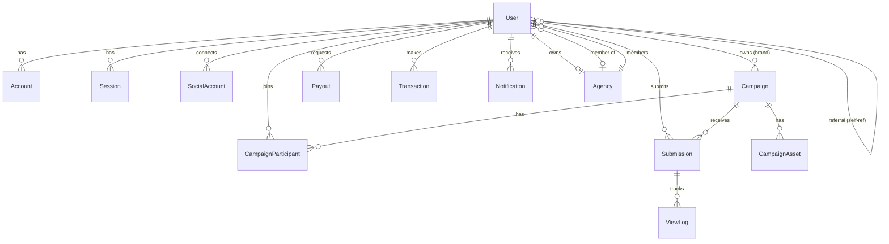
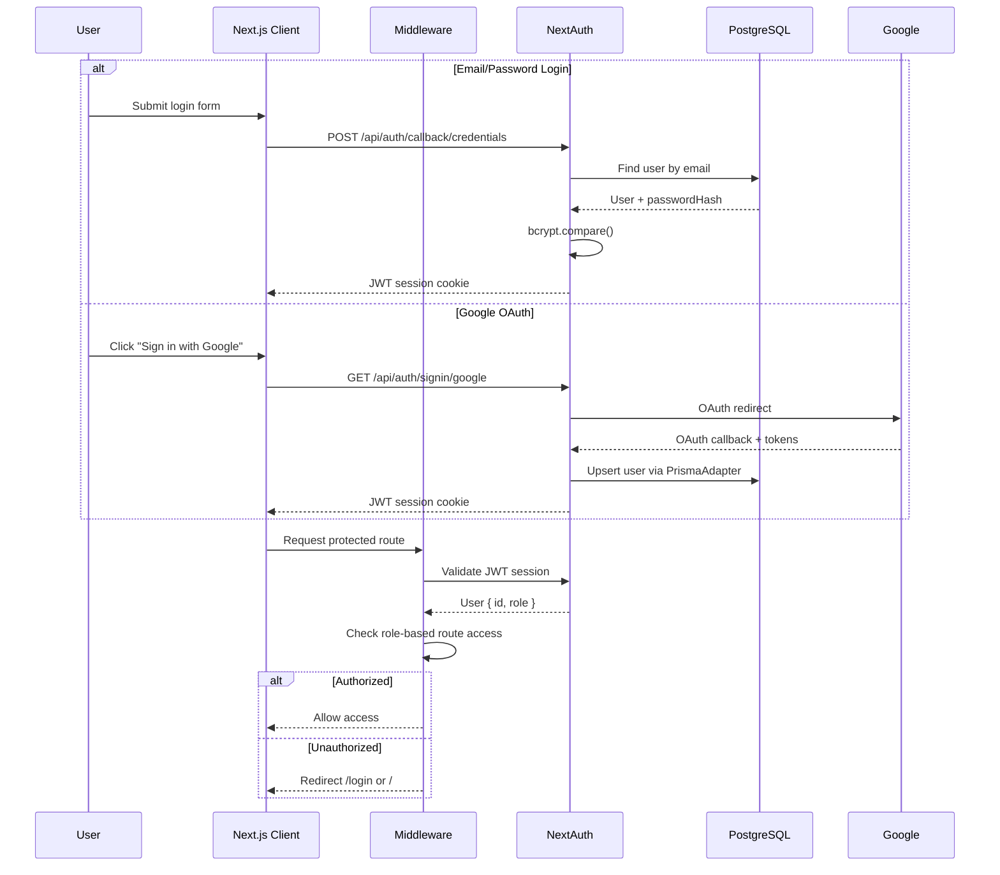
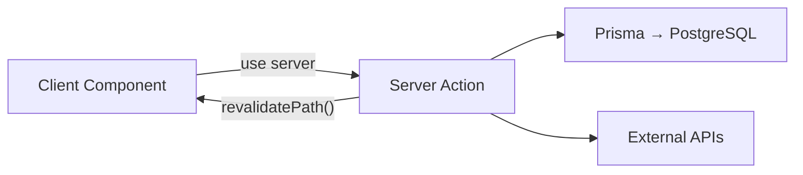
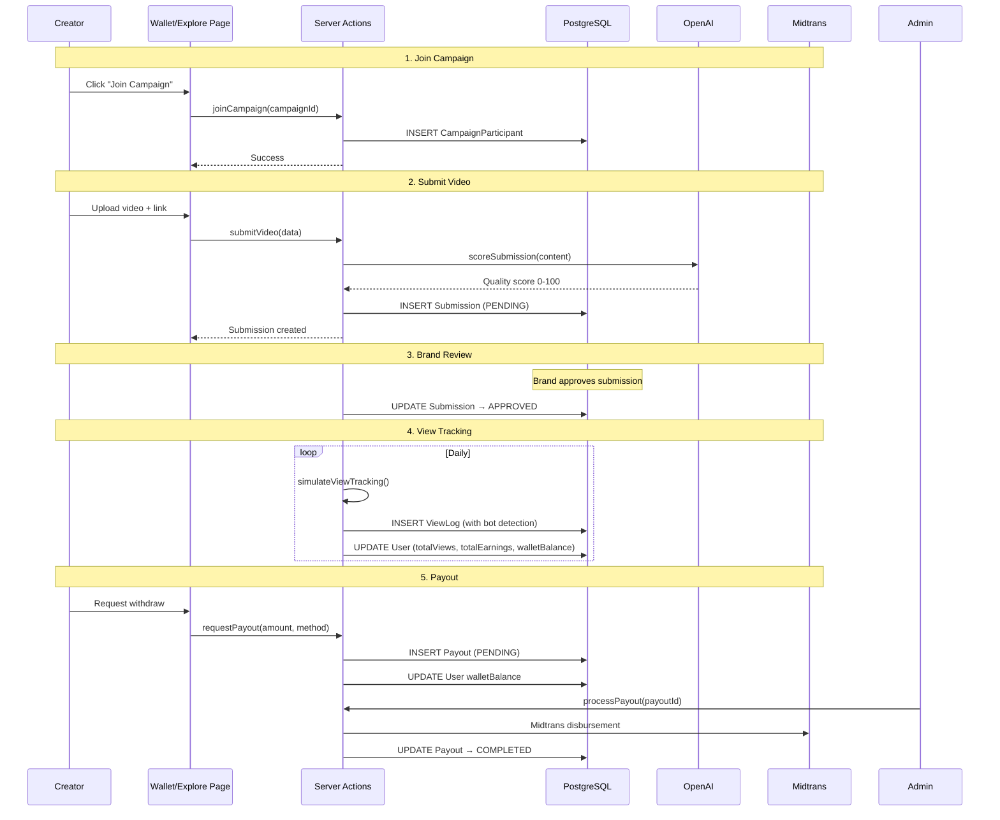
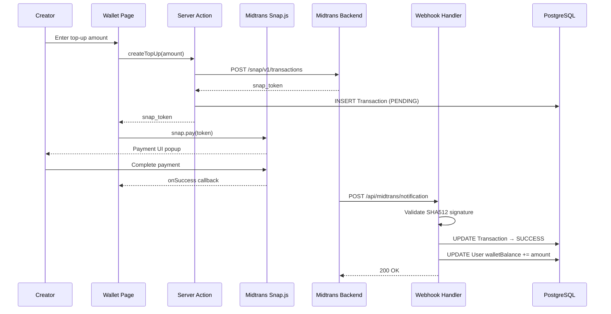

# Arsitecture GudangKlip

## System Overview



## Tech Stack

| Layer | Technology | Version |
|-------|-----------|---------|
| Framework | Next.js (App Router) | 15.5 |
| Runtime | Node.js + TypeScript | TS 5.6 |
| Database | PostgreSQL | 16-alpine |
| ORM | Prisma | 6.19 |
| Auth | NextAuth v5 (beta) | 5.0-beta.31 |
| Styling | Tailwind CSS | 4.1 |
| UI Components | Radix UI | — |
| Animations | Framer Motion | 12.40 |
| Charts | Recharts | 3.8 |
| Forms | React Hook Form + Zod | 7.80 / 4.4 |
| Icons | Lucide React | 1.21 |
| Payment | Midtrans Snap/Core | 1.4 |
| Email | Resend | 6.14 |
| AI | OpenAI | 6.44 |
| File Upload | Custom API + UploadThing | 7.7 |
| Toast | Sonner | 2.0 |

## Directory Structure

```
clipper/
├── .env.example              # Template environment variables
├── .env.local                # Actual secrets (gitignored)
├── docker-compose.yml        # PostgreSQL 16 container
├── next.config.ts            # Standalone output, image remote patterns
├── package.json              # Dependencies & npm scripts
├── postcss.config.mjs        # Tailwind CSS v4 PostCSS plugin
├── tsconfig.json             # TypeScript config (strict, path aliases)
│
├── prisma/
│   ├── schema.prisma         # 16 models, 7 enums
│   ├── seed.ts               # Seed: admin, brands, agency, creators, campaigns
│   └── migrations/           # Migration history
│
└── src/
    ├── middleware.ts          # Route protection + role-based access control
    │
    ├── types/
    │   ├── index.ts           # Shared types (SafeUser, CampaignWithBrand, etc.)
    │   └── midtrans-client.d.ts
    │
    ├── lib/
    │   ├── auth.ts            # NextAuth config (Google + Credentials provider)
    │   ├── prisma.ts          # Prisma client singleton
    │   ├── constants.ts       # Platforms, categories, roles, thresholds, sidebar links
    │   ├── utils.ts           # cn(), formatCurrency(), timeAgo(), generateReferralCode()
    │   ├── validations.ts     # Zod schemas (login, register, campaign, submission, payout)
    │   ├── midtrans.ts        # Midtrans Snap/Core API client
    │   └── email.ts           # Resend email sender (verification, payout notification)
    │
    ├── actions/               # 14 Server Action modules
    │   ├── admin.actions.ts       # Dashboard stats, user management, payout processing, campaign approval
    │   ├── agency.actions.ts      # Agency overview, member listing, invite link generation
    │   ├── ai.actions.ts          # OpenAI GPT-4o-mini submission quality scoring
    │   ├── analytics.actions.ts   # Brand analytics (ROI, cost-per-view, reach, engagement)
    │   ├── auth.actions.ts        # Social account connect, join campaign
    │   ├── campaign.actions.ts    # Campaign CRUD, brand overview, active campaigns
    │   ├── creator.actions.ts     # Creator overview stats, active campaigns, joined campaign IDs
    │   ├── leaderboard.actions.ts # Top 20 creators by total earnings
    │   ├── notification.actions.ts# In-app notification CRUD, mark read
    │   ├── payout.actions.ts      # Request payout, payout history
    │   ├── profile.actions.ts     # Update profile image, bio, social accounts
    │   ├── submission.actions.ts  # Submit video, review submission (approve/reject)
    │   ├── tracking.actions.ts    # View log simulation with bot detection
    │   └── transaction.actions.ts # Top-up initiation via Midtrans, transaction history
    │
    ├── components/
    │   ├── shared/
    │   │   ├── theme-provider.tsx  # Dark theme wrapper (next-themes)
    │   │   └── error-boundary.tsx  # React ErrorBoundary for dashboard
    │   └── dashboard/
    │       ├── sidebar.tsx         # Side navigation with role-based links + collapse toggle
    │       └── navbar.tsx          # Top navigation bar with notification dropdown
    │
    └── app/
        ├── layout.tsx              # Root layout (fonts, SessionProvider, ThemeProvider, Toaster, Midtrans Snap)
        ├── globals.css              # Tailwind imports, CSS custom variables, utility classes
        ├── page.tsx                 # Landing page (hero, how-it-works, campaigns, testimonials, FAQ, CTA)
        │
        ├── campaigns/page.tsx       # Public campaign listing with search/filter
        ├── leaderboard/page.tsx     # Public leaderboard (top 20 creators)
        │
        ├── api/
        │   ├── auth/
        │   │   ├── [...nextauth]/route.ts    # NextAuth handler (all providers)
        │   │   ├── register/route.ts         # Registration with referral + email verification
        │   │   └── verify-email/route.ts     # Email verification token handler
        │   ├── upload/route.ts               # File upload (50MB, images/video)
        │   └── midtrans/notification/route.ts # Midtrans webhook (SHA512 validation)
        │
        ├── (auth)/                   # Auth route group (no layout)
        │   ├── login/page.tsx        # Email + Google OAuth login
        │   ├── register/page.tsx     # Role selection + referral code registration
        │   └── verify/page.tsx       # Email verification page
        │
        └── (dashboard)/              # Dashboard route group (authenticated layout)
            ├── layout.tsx            # Session check + Sidebar + Navbar + ErrorBoundary
            │
            ├── creator/
            │   ├── page.tsx           # Overview: balance, views, trust score, active campaigns
            │   ├── explore/page.tsx   # Browse & join available campaigns
            │   ├── campaigns/page.tsx # Creator's joined campaigns
            │   ├── submissions/page.tsx # Submit videos + view submission history
            │   ├── wallet/page.tsx    # Balance, top-up (Midtrans), withdraw request
            │   └── profile/page.tsx   # Profile image upload + connect social accounts
            │
            ├── brand/
            │   ├── page.tsx           # Brand overview + review submissions
            │   ├── campaigns/page.tsx # Brand's campaign list
            │   ├── campaigns/new/page.tsx # Campaign creation form
            │   ├── campaigns/[id]/page.tsx # Campaign detail + review submissions
            │   └── analytics/page.tsx # Campaign performance analytics
            │
            ├── agency/
            │   ├── page.tsx           # Agency overview (members, earnings, commission)
            │   └── members/page.tsx   # Member list with invite link
            │
            └── admin/
                ├── page.tsx           # Platform stats + campaign approvals
                ├── users/page.tsx     # User management (role editing)
                └── payouts/page.tsx   # Payout processing (process, complete, fail)
```

## Database Schema (ERD)



### Enums

| Enum | Values |
|------|--------|
| `Role` | BRAND, CREATOR, AGENCY, ADMIN |
| `Platform` | TIKTOK, INSTAGRAM, YOUTUBE |
| `Category` | MUSIC, FILM, BRAND, ENTERTAINMENT |
| `CampaignStatus` | DRAFT, ACTIVE, PAUSED, ENDED |
| `SubmissionStatus` | PENDING, APPROVED, REJECTED |
| `PayoutStatus` | PENDING, PROCESSING, COMPLETED, FAILED |
| `ParticipantStatus` | ACTIVE, COMPLETED, REMOVED |

### Core Models

| Model | Fields | Description |
|-------|--------|-------------|
| **User** | id, name, email, role, walletBalance, trustScore, totalViews, totalEarnings, referralCode, agencyId | Central entity for all roles |
| **Campaign** | id, brandId, title, description, totalBudget, remainingBudget, cpmRate, startDate, endDate, status | Brand-created campaign |
| **Submission** | id, campaignId, creatorId, videoUrl, platformLink, platform, status, aiScore | Creator's submitted video |
| **ViewLog** | id, submissionId, views, date, isBotFiltered, payoutAmount | Per-day view tracking |
| **Payout** | id, creatorId, amount, status, payoutMethod, accountInfo | Creator withdrawal request |
| **Transaction** | id, userId, amount, status, midtransOrderId, paymentMethod | Payment/top-up record |
| **Agency** | id, name, ownerId, commissionRate, totalEarnings | Agency with members |
| **SocialAccount** | id, userId, platform, username, verified, followersCount | Connected social media |
| **Notification** | id, userId, title, message, isRead, link | In-app notification |

## Authentication Flow



## Middleware & RBAC

Middleware (`src/middleware.ts`) protects all non-public routes:

| Route Pattern | Access |
|--------------|--------|
| `/`, `/login`, `/register`, `/campaigns`, `/leaderboard` | Public |
| `/brand/*` | BRAND role only (or ADMIN) |
| `/creator/*` | CREATOR role only (or ADMIN) |
| `/agency/*` | AGENCY role only (or ADMIN) |
| `/admin/*` | ADMIN role only |
| `/api/*` | Bypass middleware (handled inline) |

- Authenticated users hitting `/login` or `/register` are redirected to their role dashboard
- Unauthenticated users hitting protected routes are redirected to `/login`

## Server Actions (Data Access Layer)

All database mutations go through Server Actions — no direct Prisma calls from client components.



| Action Module | Key Functions |
|--------------|--------------|
| `admin.actions` | `getAdminDashboard()`, `getUsers()`, `updateUserRole()`, `getPendingCampaigns()`, `approveCampaign()`, `getPayouts()`, `processPayout()` |
| `agency.actions` | `getAgencyOverview()`, `getAgencyMembers()`, `getAgencyInviteLink()` |
| `ai.actions` | `scoreSubmission(content, description)` → GPT-4o-mini |
| `analytics.actions` | `getBrandAnalytics(brandId)` → reach, engagement, cost-per-view, ROI |
| `auth.actions` | `connectSocialAccount()`, `joinCampaign(campaignId)` |
| `campaign.actions` | `getBrandOverview()`, `createCampaign()`, `getActiveCampaigns()`, `getCampaignDetail()` |
| `creator.actions` | `getCreatorOverview()`, `getMyCampaigns()`, `getJoinedCampaignIds()` |
| `leaderboard.actions` | `getLeaderboard()` → top 20 creators by earnings |
| `notification.actions` | `getNotifications()`, `markAllRead()`, `markAsRead()` |
| `payout.actions` | `requestPayout()`, `getPayoutHistory()` |
| `profile.actions` | `updateProfileImage()`, `updateProfile()` |
| `submission.actions` | `submitVideo()`, `getSubmissions()`, `reviewSubmission()`, `approveSubmission()`, `rejectSubmission()` |
| `tracking.actions` | `getViewLogs()`, `simulateViewTracking()` |
| `transaction.actions` | `createTopUp(amount)`, `getTransactionHistory()` |

## API Routes

| Route | Method | Auth | Purpose |
|-------|--------|------|---------|
| `/api/auth/[...nextauth]` | ALL | — | NextAuth handler |
| `/api/auth/register` | POST | — | User registration |
| `/api/auth/verify-email` | POST | — | Email verification token |
| `/api/upload` | POST | Session | File upload (50MB) |
| `/api/midtrans/notification` | POST | — | Midtrans webhook handler |

## Data Flow: Campaign Submission



## Data Flow: Top-Up (Midtrans)



## Component Architecture

```
RootLayout
├── SessionProvider (next-auth/react)
│   └── ThemeProvider (next-themes, dark-only)
│       └── Toaster (sonner)
│           ├── Landing Page (public)
│           │   ├── HeroSection
│           │   ├── HowItWorksSection
│           │   ├── HotCampaignsSection
│           │   ├── WhyUsSection
│           │   ├── TestimonialsSection
│           │   ├── FAQSection
│           │   └── CTASection
│           ├── Auth Pages (/login, /register, /verify)
│           └── Dashboard Layout (protected)
│               ├── Sidebar (role-based links)
│               ├── Navbar (notifications dropdown)
│               └── ErrorBoundary
│                   └── Page Content (per route)
└── Script (Midtrans Snap.js, afterInteractive)
```

## Cost Constants

| Constant | Value | Description |
|----------|-------|-------------|
| `DEFAULT_CPM` | Rp 3.000 | Default cost per 1000 views |
| `MIN_WITHDRAW` | Rp 50.000 | Minimum withdrawal amount |
| `MIN_TOPUP` | Rp 10.000 | Minimum top-up amount |
| `MAX_TOPUP` | Rp 100.000.000 | Maximum top-up amount |
| `TRUST_SCORE_THRESHOLDS` | Bronze: 30, Silver: 60, Gold: 85 | Creator trust tier thresholds |
